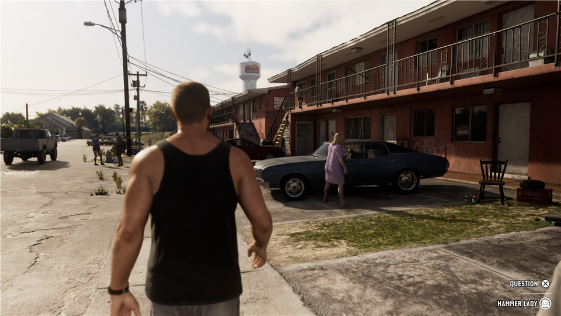
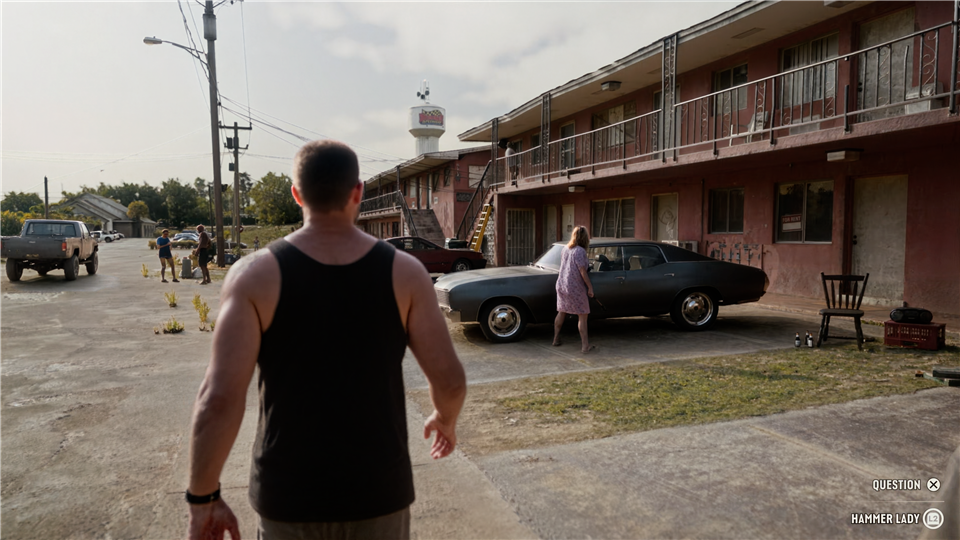

**NVIDIA-based DLSS 5 neural enhancement for video and high-resolution images — one 4x4Tools suite for After Effects, Premiere Pro and Photoshop.** Adjust lighting, materials and fine detail, then blend back the original shot with editable preservation controls.

This is an **independent community integration**, using a modified NVIDIA neural-rendering runtime. It is not an official NVIDIA or Adobe product. Existing footage does not supply a game's real motion and depth data, so the suite does not reproduce the complete 3D-guided DLSS 5 pipeline. It enhances existing pixel dimensions; there is no upscaling or frame generation.

### Download the v1.2 suite

| Download | Contents |
| --- | --- |
| **[Windows installer EXE](https://github.com/Insider4444/4x4-Tools-DLSS-5/releases/download/v1.2.0/4x4Tools-DLSS5-win-v1.2.0-Setup.exe)** | Recommended. AE/Premiere effect, Photoshop filter, runtime and guides. Checks your GPU before installation begins. |
| **[Manual-install ZIP](https://github.com/Insider4444/4x4-Tools-DLSS-5/releases/download/v1.2.0/4x4Tools-DLSS5-win-v1.2.0.zip)** | The same plug-in files, helpers and runtime, with README.txt. No source, SDKs or build scripts. |
| [SHA-256 checksums](https://github.com/Insider4444/4x4-Tools-DLSS-5/releases/download/v1.2.0/SHA256SUMS.txt) | Verify the EXE and ZIP against the GitHub-built release. |

One offline package; no separate model account or download. The installer is unsigned, so Windows may show an unknown-publisher prompt. The runtime has separate terms from the project's MIT source license.

### See the difference

**[Open the interactive before/after gallery](https://insider4444.github.io/4x4-Tools-DLSS-5/gallery/)** — six matching scenes with a draggable divider and keyboard controls.

| Original | Enhanced |
| --- | --- |
|  |  |

These are publisher-supplied game-footage examples, with labels confirmed and framing checked. Gallery copies are resized equally to 960 × 540. Their generating version and settings were not recorded; they are not a Photoshop v1.2 benchmark or a promise for every image. [Image provenance](docs/gallery/PROVENANCE.md).

### Start in your Adobe app

1. Save your work and fully close AE, Premiere and Photoshop. Run the installer.
2. Setup renders a real neural test on your GPU. An unsupported system receives the failure reason before any plug-in files are replaced.
3. **AE / Premiere:** search Effects for **4x4Tools-DLSS5**, under **4x4Tools**. Begin with **Natural balance** and compare using the original/neural wipe.
4. **Photoshop 2026+:** open an RGB image and choose **Filter → 4x4Tools → DLSS5 - Image Enhancement**. Choose a preset, preview a crop, toggle Original, then Apply to the full image.

Read the [Photoshop guide](docs/PHOTOSHOP.md), [shared controls](docs/CONTROLS.md), [installation help](docs/INSTALLATION.md) and [GPU compatibility](docs/COMPATIBILITY.md).

### Creative control across the suite

| Purpose | Controls |
| --- | --- |
| Shape neural rendering | Three styles, intensity 0–200%, tone, structure and automatic neural mask. |
| Find a starting point | Eight editable recipes: natural balance, skin, action, products, landscapes, low light, animation/game footage and strong enhancement. |
| Keep the original character | Original color and lighting, highlight/shadow protection, texture recovery, detail, radius and artifact protection. |
| Finish the image | Saturation, warmth, tint and exposure in stops. |
| Compare and select | Mix, original/neural wipe, amplified difference, effect matte, inside/outside ellipse and feathering. |

For video production, use restrained settings to explore a more photographic treatment of game captures or CG, adjust a shot's texture and lighting, and retain important original features. Presets are starting points. Strong enhancement can change faces, lettering or patterns; check motion and a short export before committing a sequence.

### High-resolution Photoshop processing

The native .8bf filter processes RGB **8-, 16- and 32-bit** images in overlapping tiles. It retains dimensions, ICC profile and transparency, uses large-document coordinates, and stages output before committing it to Photoshop. A 512 MiB CPU tile budget and selectable tile sizes keep buffers bounded; Photoshop, ICC, GPU and temporary storage are additional.

The coordinate interface supports dimensions up to 300,000 pixels. Actual capacity depends on time, memory and scratch space; this is not a claim of testing a 90-gigapixel image. The neural model uses an 8-bit proxy, with float residual reconstruction preserving finer original information. HDR remains experimental. [High-resolution details](docs/PHOTOSHOP.md#high-resolution-images).

### GPU coverage and limits

The bundled **310.8.SF-v2** community runtime targets **RTX 20 / 30 / 40 / 50** generations. We physically tested an **RTX 5070 with driver 616.64**. Other cards must pass setup's render check; they are not individually certified. RTX 20/30 paths may be much slower. GTX, AMD, Intel and CPU-only processing have no backend. [Evidence and compatibility matrix](docs/COMPATIBILITY.md).

AE supports 8/16/32-bit host buffers and Multi-Frame Rendering registration. GPU work is serialized within each Adobe process. Premiere uses the legacy ARGB8 effect route. History resets per frame; this is not a temporal denoiser and cannot guarantee flicker-free output.

### Develop and release

One public source repository contains the plug-ins, tests, documentation and release automation. Proprietary SDKs stay in a separate private dependency repository and the private portable developer kit.

- [Development workflow](docs/DEVELOPING.md): debug-install.ps1 builds/tests/installs local changes; deploy-main.ps1 triggers GitHub Actions to build and publish the exact version with your Markdown notes.
- [Build from source](docs/BUILDING.md) · [Validation record](docs/VALIDATION.md) · [Changelog](CHANGELOG.md)
- [Report a problem](https://github.com/Insider4444/4x4-Tools-DLSS-5/issues/new?template=bug_report.yml) — include host, GPU, driver, image dimensions and the setup/render error.

Update-aware versions show a small version/update notice in the effect or Photoshop dialog. Daily checks can be disabled; manual checks and release downloads are available. The plug-in never uploads images or footage and never installs updates automatically.

### Credits

4x4Tools source is [MIT](LICENSE). The backend adapts [Resolve DLSS5](https://github.com/SAOG0721/DaVinci-Resolve-DLSS5); Photoshop ICC processing uses [Little CMS](https://github.com/mm2/Little-CMS). NVIDIA and Adobe components retain separate terms and ownership. See [third-party notices](THIRD-PARTY-NOTICES.md). Product names are their respective owners' marks.