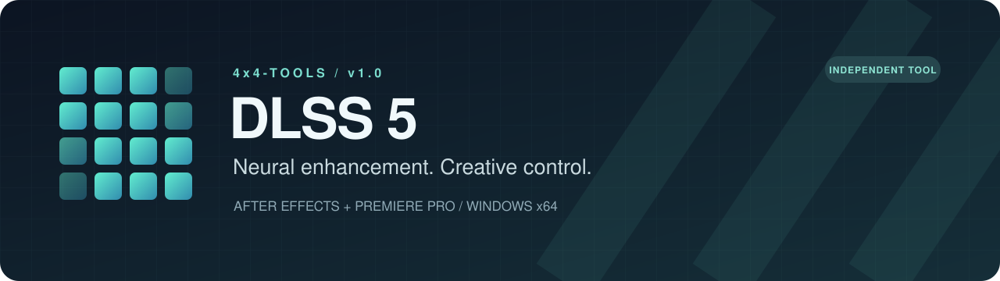

**Neural video enhancement for Adobe After Effects and Premiere Pro, with control over how much of the original shot you preserve.** Three neural styles, eight editable footage presets, intensity up to 200%, natural restoration, color finishing and selective blending.

### Download v1.0

| Package | Choose this when… |
| --- | --- |
| **[Windows installer — EXE](https://github.com/Insider4444/4x4-Tools-DLSS-5/releases/download/v1.0/4x4-Tools-DLSS-5-v1.0-Setup.exe)** | You want guided setup and an entry in Windows Installed apps. Recommended. |
| **[Full package — ZIP](https://github.com/Insider4444/4x4-Tools-DLSS-5/releases/download/v1.0/4x4-Tools-DLSS-5-v1.0-Windows-x64.zip)** | You prefer an extracted package with PowerShell install, validate and uninstall scripts. |
| [SHA-256 checksums](https://github.com/Insider4444/4x4-Tools-DLSS-5/releases/download/v1.0/SHA256SUMS.txt) | Verify the downloaded EXE or ZIP. |

Both packages include the same plug-in and neural runtime. No separate model download or account is required. The installer is currently **unsigned**; Windows may display an unknown-publisher or SmartScreen prompt. Obtain releases from this repository and check the published checksum before running them.

### Get started

1. Save your projects and fully close After Effects and Premiere Pro.
2. Run the EXE. Setup checks file integrity and renders a small neural test on your GPU before replacing the plug-in. An incompatible system gets an error and log; its previous installation stays in place.
3. Reopen Adobe and search Effects for **4x4Tools-DLSS5**, in the **4x4Tools** category.
4. Choose **Natural balance** under **Footage preset**. Compare with **Output → Original / neural wipe**, then return to **Processed** before export.

Read the **[controls guide](docs/CONTROLS.md)** · **[installation and troubleshooting](docs/INSTALLATION.md)** · **[GPU compatibility](docs/COMPATIBILITY.md)**.

### Shape the result

| Feature | Controls |
| --- | --- |
| Neural rendering | Default, Natural and Cinematic styles; intensity 0–200; tone; structure; automatic neural mask. |
| Eight footage recipes | Natural balance, Portrait / skin, Sports / action, Product / fabric, Landscape / daylight, Low light / gentle, Animation / game, Strong enhancement. |
| Natural restoration | Original color and lighting, highlight/shadow protection, texture recovery, soft/crisp detail, radius and artifact protection. |
| Color finishing | Saturation, warmth, tint and exposure in stops. |
| Compare and blend | Mix, original/neural wipe, amplified difference, effect matte, inside/outside ellipse and feathering. |

Presets change real processing parameters and remain editable. Changing a recipe slider switches to Manual without resetting the other values. These are starting recipes, not automatic scene classification. Preset names describe an intended use, not a promise of a particular result.

### Requirements and verified scope

- **Windows x64**, an installed x64 After Effects or Premiere Pro, and an NVIDIA RTX GPU with a compatible driver/runtime combination.
- **Verified locally:** RTX 5070, driver 616.64. The installer tests actual processing; RTX 30/40/50 cards are not universally certified. See the [compatibility matrix](docs/COMPATIBILITY.md).
- AE supports 8-, 16- and 32-bit host buffers and Multi-Frame Rendering registration. GPU work is serialized within each Adobe process. Premiere uses the legacy Adobe effect route; native Premiere 32-bit GPU processing is not implemented.

### What this release does

This is an **independent, unofficial integration using a community-modified DLSS neural-rendering runtime**. It is not an NVIDIA or Adobe product, and does not reproduce NVIDIA's complete 3D-guided DLSS 5 pipeline. The application package is a stable v1.0 release; the neural integration itself remains experimental.

Processing stays at the input resolution: **no upscaling or frame generation**. The neural stage uses an RGBA8 proxy, without real depth or motion vectors, and resets history every frame. HDR is experimental. Fine textures, faces, text and moving shots can change or flicker; inspect your final footage. More intense settings are not automatically more realistic.

Start with restrained intensity and preservation controls. Neutral finishing takes the fast path; restoration adds CPU work. A successful installer test establishes basic runtime compatibility, not guaranteed performance or memory capacity for every project resolution.

### Build, contribute and report an issue

The repository includes the plug-in, finishing engine, installer, tests, documentation and packaging scripts. Proprietary Adobe/NVIDIA SDK development files are supplied locally and are **not** uploaded here. The runtime is distributed in release packages under its separate terms, not committed to Git.

- [Build from source](docs/BUILDING.md)
- [Validation record](docs/VALIDATION.md)
- [Contributing](CONTRIBUTING.md) · [Report a bug](https://github.com/Insider4444/4x4-Tools-DLSS-5/issues/new?template=bug_report.yml)
- [Changelog](CHANGELOG.md)

### Credits and licensing

4x4-Tools source is [MIT licensed](LICENSE). The backend adapts [SAOG0721/DaVinci-Resolve-DLSS5](https://github.com/SAOG0721/DaVinci-Resolve-DLSS5), with its [MIT notice](licenses/UPSTREAM-MIT.txt) retained. NVIDIA SDK/runtime components have separate terms: read [third-party notices](THIRD-PARTY-NOTICES.md) and [NVIDIA's included license](licenses/NVIDIA-RTX-SDK.txt). MIT does not grant rights to those components. NVIDIA, DLSS, Adobe, After Effects and Premiere Pro are their respective owners' marks.
